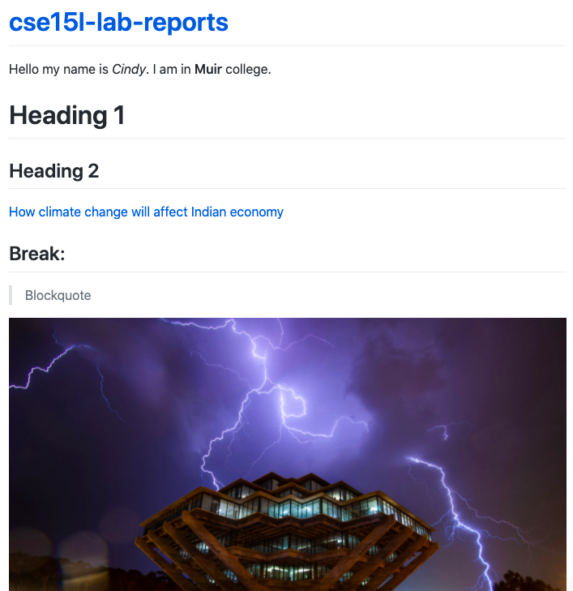
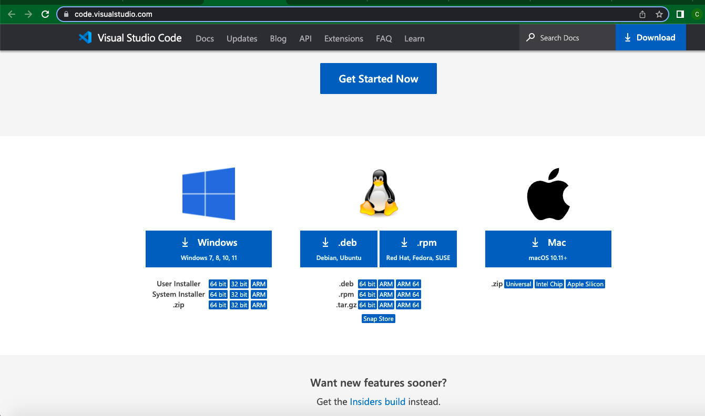
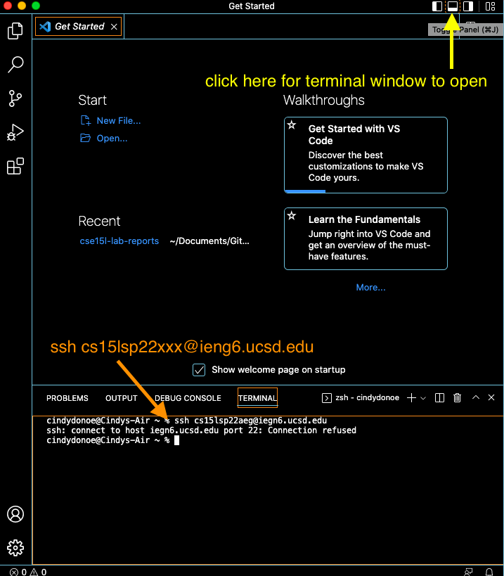
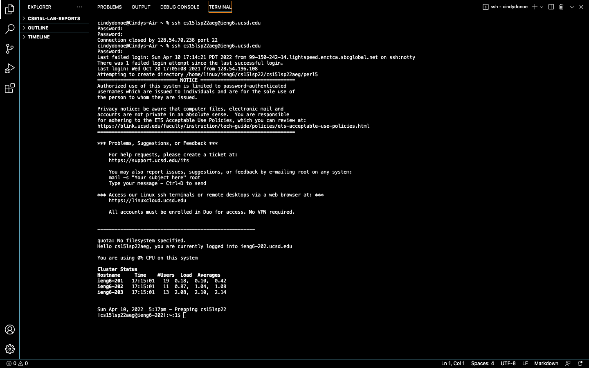

# Lab Report Week Two

Below  is a screenshot of lab 2. 

## Tutorial for ssh into a remote account 

1. Install VScode 

Follow [this link](https://code.visualstudio.com/) in order to download VScode onto your computer. At the bottom of the webpage (from link) there are download instructions for each of the different computer software. Choose the one that works best for your system. I picked the zipper file labeled Mac.    

2. Connect to remote host 
To remotely connect to a host we need to first open the terminal. Using your terminal, type your account. $ ssh cs15lsp22xxx@ieng6.ucsd.edu. When first attempting to connect, the connection will be refused. But after retyping it, you are prompted to enter your password. Once the password is entered, there will be a statement saying you were successfully logged on. 

