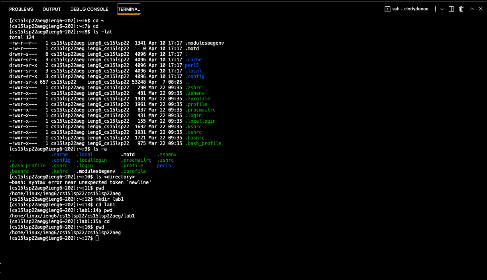
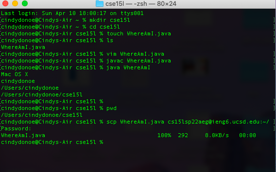
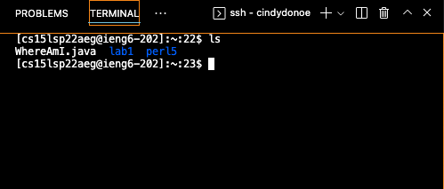
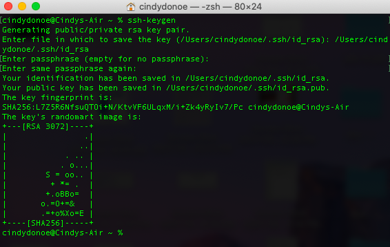
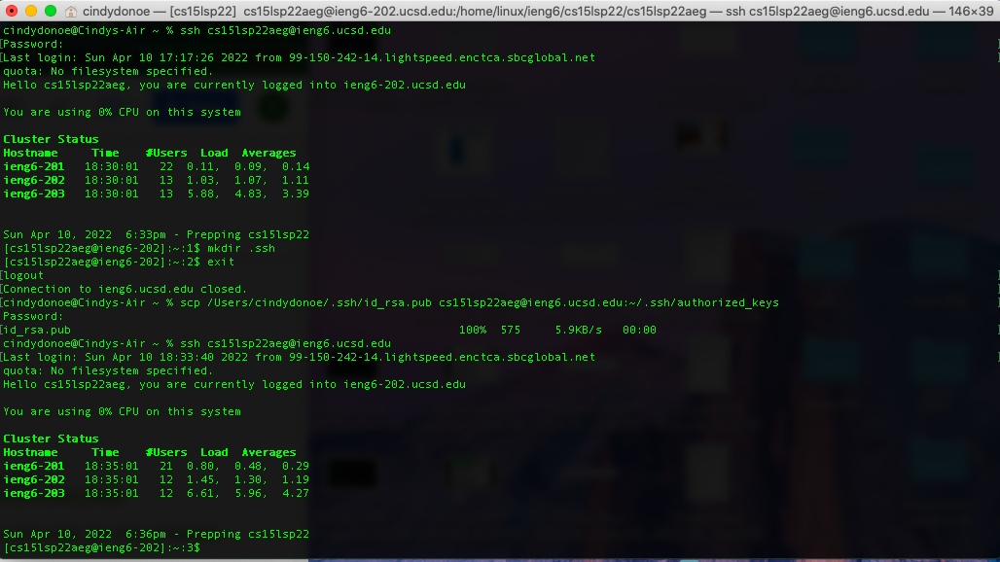
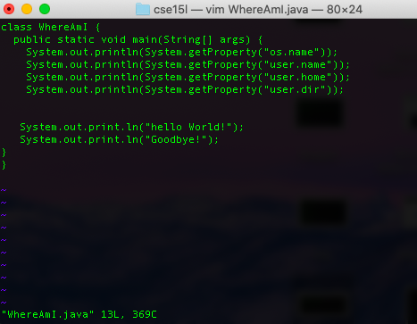
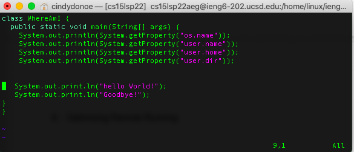

# Lab Report Week Two

# Tutorial for ssh into a remote account 

# 1. Install VScode

Follow [this link](https://code.visualstudio.com/) in order to download VScode onto your computer. At the bottom of the webpage (from link) there are download instructions for each of the different computer software. Choose the one that works best for your system. I picked the zipper file labeled Mac.    

# 2. Connect to remote host

To remotely connect to a host we need to first open the terminal. Using your terminal, type your account. `ssh cs15lsp22xxx@ieng6.ucsd.edu` When first attempting to connect, the connection will be refused. But after retyping it, you are prompted to enter your password. Once the password is entered, there will be a statement saying you were successfully logged on. 

# 3. Using Commands

* used `mkdir` to make a new lab1 directory
* `cd` (change) directories from lab1 back to home
* `pwd` to find which current directory I was in. I was also able to use ls to list my files
* cleared my screen by using the command `clear` at the end. 

# 4. Move files using command scp
* create file inside a directory that is not home
* file is created on your *local* computer, we will try to copy it onto your *remote* computer
* use `ls` to see if file is made
* edit file and write something 
* use `pwd` to ensure you're in the right directory for your file 
* copy file by using command `scp` 
* `scp filename.java cs15lsp22xxx@ieng6.ucsd.edu:~/`
* enter password when prompted
* copy successful 
* check on remote machine by using `ls`

# 5. Set up SSH key
Set up an SSH key so you do not have to continuously keep typing your password. On your local terminal use `ssh-keygen`.You will be prompted to enter a file. The file to save the key is /Users/<username>/.ssh/id_rsa. There is no passphrase, press enter to leave empty. Your key fingerprint will appear.

You will need to link your fingerprint to your remote account. Sign onto your remote account and once signed on, use command `mkdir`. Then logoff your remote machine and sign on to your local machine. Use the `scp` command to link it. 

# 6. Optimizing Remote Running
To copy over the local changes I made, I had to ensure I was in the right directory. I used `pwd` to ensure I was in the right place. On my local machine, I used the command `scp` to copy. I first forgot to include -201 on ieng6 when trying to copy. But to copy my local changes I had to use `scp file.java cs15lsp22xxx@ieng6-201.ucsd.edu:~/directory`

# Lab 2 Screenshot 
Here is a screenshot of lab 2. 

