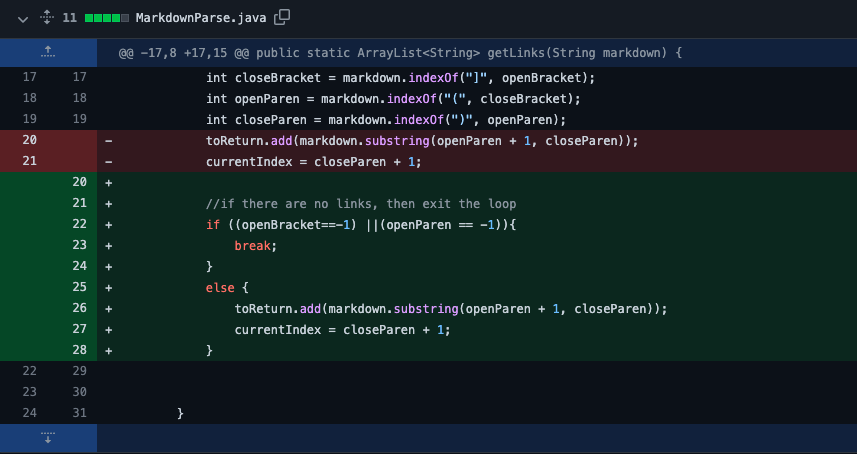
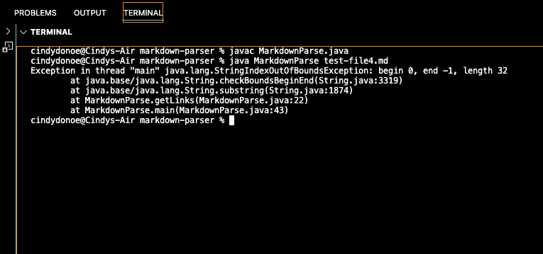
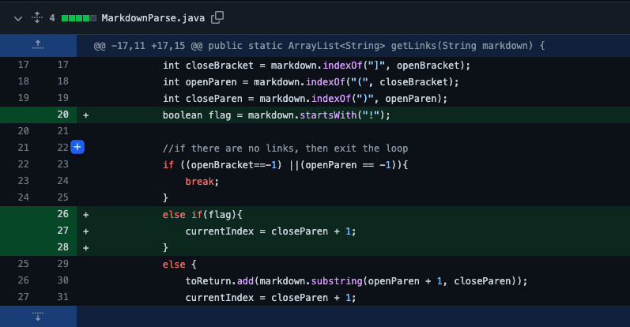
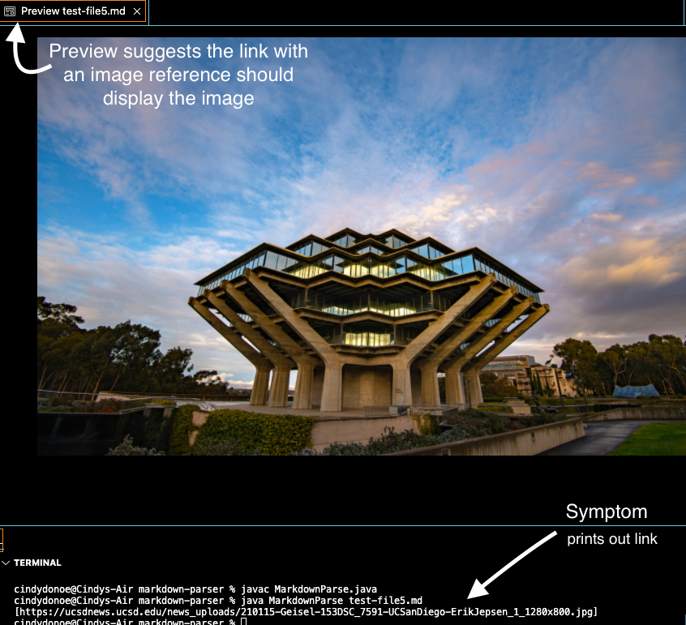
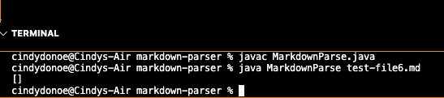

# Lab Report 2
## Week 4

# Change 1: No link in the test file 
### Code Change 

### Symptom 

### Link to test file for _failure-inducing input_ 
* [test-file4.md](https://github.com/cindy4127/markdown-parser/commit/dfef581544d69a463027107699984290006f1f0a)
### Explanation
There is no link present in the file. There is just the instructions to copy a link into the file. As a result of there being no links, some variables will not be found while looping through. This will cause an out of bounds error, as the variables are set to -1. In the case of `toReturn.add(markdown.substring(openParen + 1, closeParen));` -1 is substituted for both openParen and closeParen. This attempts to access a substring of size (0,-1), which is invalid. Which is why we see the out of bounds error as our symptom. 

# Change 2: Link contains image reference
### Code Change 

### Symptom 

### Link to test file for _failure-inducing input_ 
* [test-file5.md](https://github.com/cindy4127/markdown-parser/commit/297ec59e7c0751a682842b4f188c56840f517716)
### Explaination 
The link present in the file is a reference to a google image photo of ucsd. The link is supposed to lead directly to the jpg file. MarkDownParse does not recognize the link to be an image and prints out the link to the photo. It does not recognize it as an image, but rather sees it as a link. Adding the boolean flag case allows it to check for an "!" to let it know if it is an image or not. If the "!" is recognized then it will no longer be recognized as a link, and no link will be found in the test file (since it only has an image reference).

# Change 3: Extra spaces between [] and ()
### Symptom 

* The symptom shows that there is no link found inside the file, even though the file includes a link. There is just spaces seperating [name] and the the () that hold the link. 

