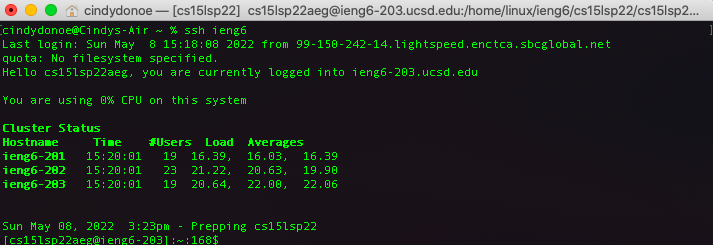
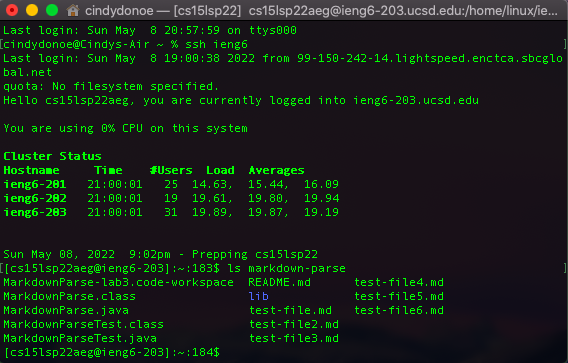

# Lab Report 3  
## Week 6

# Streamlining ssh Configuration 
 * I acessed my `.ssh/config` file by creating the file by using vim. 
 
 * I edited the file using vim. 
 
    * Once I made these changes, I was able to log into my remote account by using the command `ssh ieng6`
        * 
 * `scp` command 
    * I first created a local directory and file by using `vim ~/lab5A/test.txt`
    * I also created a remote directory so the file could have a destination. I logged on by `ssh ieng6` and created a directory `mkdir week6`
        * 
    * Copied test.txt from local machine to remote machine
        * `scp lab5A/* ieng6:~/week6`

    

# Setup Github Access from ieng6
* Once I had a copy of my public key, I copied it into my github account to make a new ssh key.

    * `cat ~/.ssh/id_rsa.pub` to print out the key in terminal 

* 
    * I made a SSH key for my personal laptop and my remote CSE 15L account

# Copy whole directories with `scp -r`
* Copied my whole markdown-parse directory to my ieng6 account 

* Markdown-parse is successfully copied, as it shows up on my remote machine. 

* Compiling and running the tests for markdown-parse on my remote ieng6 account 
* 