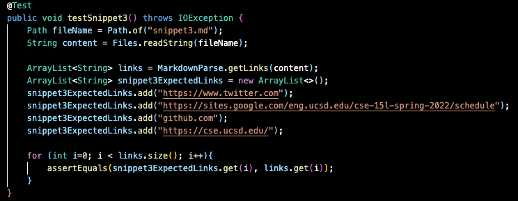

# Lab Report 4
## Week 8 

# Adding more Markdown-Parse Tests 
* My Repository: [link](https://github.com/cindy4127/markdown-parser)
* Other Group's Repository: [link](https://github.com/cindy4127/Markdown-Parser-Review-Group)

# Snippet 1
* Expected output: 
    * url.com
    * google.com
    * google.com
    * ucsd.edu

## Test for Snippet 1 

## Personal output 
There was no failure for this test. The test ran, but did not detected failure. 

## Output of reviewed repo: 

## Potential fix 
* I believe that there is a small code change needed for snippet 1. Markdown only seems to have an issue with backticks if they are on the outside of the bracket (either in front or behind). We can solve this issue by adding an if condition that checks whether backticks exist outside of the bracket or not.

# Snippet 2
* Expected output:
    * a.com
    * b.com
    * a.com(())
    * example.com

## Test for Snippet 2

## Personal output 
There was no failure for this test.  The test ran, but did not detect a failure. 

## Output of reviewed repo: 

## Potential fix
* I believe that snippet 2 needs more than just a small code change in order to make the program properly function. This is because detecting nested parenthesis/brackets is difficult if there are many of them present in the test snippet. There is no particular way to extract all the nested parenthesis and brackets that are prevalent in snippet 2, and as a result it would require a longer, more specific code change in order to account for the various situations that can occur when parsing through the nested characters.

# Snippet 3
* Expected output:
    * https://www.twitter.com
    * https://sites.google.com/eng.ucsd.edu/cse-15l-spring-2022/schedule
    * github.com
    * https://cse.ucsd.edu/

## Test for Snippet 3

## Personal output:

## Output of reviewed repo: 

## Potential fix
* I think snippet 3 would need a small code change. It would involve removing existing whitespaces that exist in the code, as the issue here involves newlines in both parenthesis and brackets. In doing so, our method would work, since we would be able to find the opening/closing parenthesis/brackets
