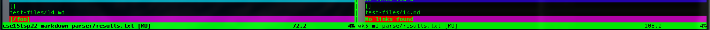
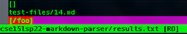
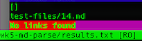
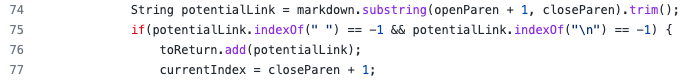
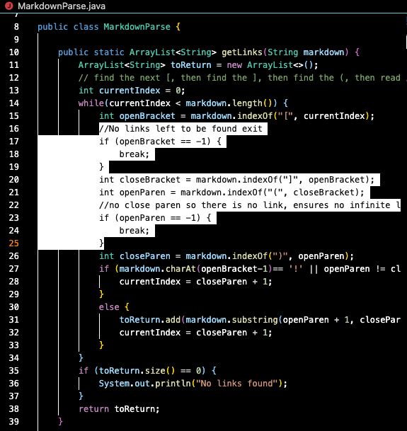

# Lab Report 5
## Week 10

# Finding tests with different results 
I was able to find tests with different results by using `vimdiff` on the results of `script.sh`. I used the steps from Lab 9 to redirect the results of the `script.sh`. I ran the command `bash script.sh > results.txt` in the implementation provided in lab 9 and my group's representative implementation. Once I had two `results.txt` files, one from the provided implementation and one from a representative of my group. I ran `vimdiff cse15lsp22-markdown-parser/results.txt wk-5-parse/results.txt` to compare results of each test. 
* After running `vimdiff` I found differences in:
    * test-files/14.md [link](https://github.com/nidhidhamnani/markdown-parser/blob/main/test-files/14.md)
    * test-files/472.md [link](https://github.com/nidhidhamnani/markdown-parser/blob/main/test-files/472.md)

# Test One: 14.md 
**Expected Output** 

Expected output should be `[]` because there are no links present in 14.md. 

**Actual Ouput** 
* `vimdiff` results

* Implementation from lab 9 
    * 
* Group Representative implementation 
    * 

**Which implementation is correct?**

My group's implementation is correct because it successfully parsed that there was no links present.  

**Bug in Code**

There is a bug in the provided implementation. When parsing the test-file, it incorrectly finds `/foo` as a url. The code in unable to determind that `/foo` is an incorrect reference to a link.

**Possible Fix**

The segment of code that should be changed in the provided implementation. 

# Test Two: 472.md
**Expected Output** 

Expected output should be `(/url)` because it is formatted as a valid link in 472.md

**Actual Ouput** 
* `vimdiff` results

* Implementation from lab 9 
    * 
* Group Representative implementation 
    * 

**Which implementation is correct?**

My group's implementation is incorrect because it parsed that there is no links present. The provided implementation gave the correct output. 

**Bug in Code**

There is a bug in my group's implementation. There is a bug in my implementation that prevents anything from being returned. This might be because the for loop breaks before it can return the expected link.

**Possible Fix**

The segment of code that should be changed:

